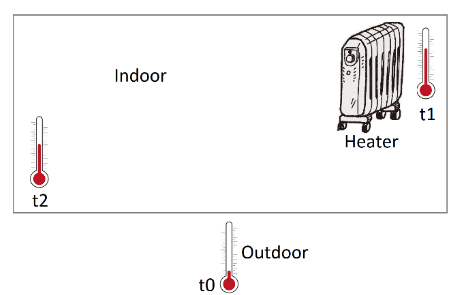

# Java-Assignment-1

## The system:

You mustdesign and implement a simple applicationfor a module to control the heating system in a summerhouse.
There is one heater with the power positions 0, 1, 2 and 3, where 0 indicates that the heater is turned off, 1 is low power, 2 is medium power and 3 is the highest power.There is a timeout in power position 3 such the radiator after a timeout automatically goes to power position 2.

The indoor temperatures are measured in two locations, thermometer t1 near the heater, and thermometer t2 in the opposite corner. The distance between t1 and heater is 1 m and the distance between t2 and the heater is 7 m.

The temperature depends on the heaters power, the distance to the heater and the outdoor temperature. The method given in Appendix on the last pagemay be used to calculate temperature values

## The assignment:

From a GUI with at least two windows, you: 
- Show the current indoor temperatures (from both indoor thermometers), the outdoor temperature, and the heaters power position.
- Get warnings if an indoor temperature passes critical values HIGH or LOW.
- Control the heater (only options to turn up and to turn down).
- Define the critical values HIGH and LOW.
- Optionally, show in tables or charts, the values from the latest say 20 measurements.
- From two threads (one for t1 and one for t2) you simulate the current indoor temperature.
- The temperature is measured and sendafter 4to8 seconds (in average every 6thsecond).
- Optional:simulate the outdoor temperaturein another thread, e.g. using the method in Appendix B. Alternatively, use a fixed value.

## Requirements

- You mustuse MVVM with at least two different windows. 
- You mustuse the Observerdesign pattern as part of the solution.
- You must use the State design pattern for the different power states for the radiator. This includes that power state 3 has a timeout andautomatically turnsdown the radiator after say 40 seconds.
- You must use a thread for each of the thermometers t1 and t2. 
- It is required to make a class diagram for the final solution and a state machinediagram for the radiator (both in Astah). In the diagram you mustbe able clearly to identify the different MVVM parts,the Observer pattern, the State patternand the classes related to the threads.

## The result

## Class Diagram

